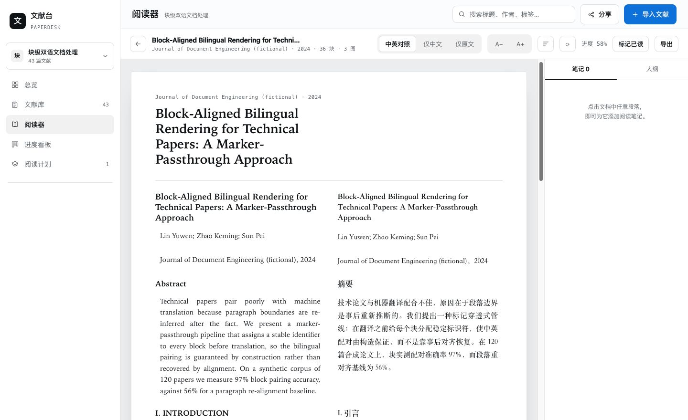
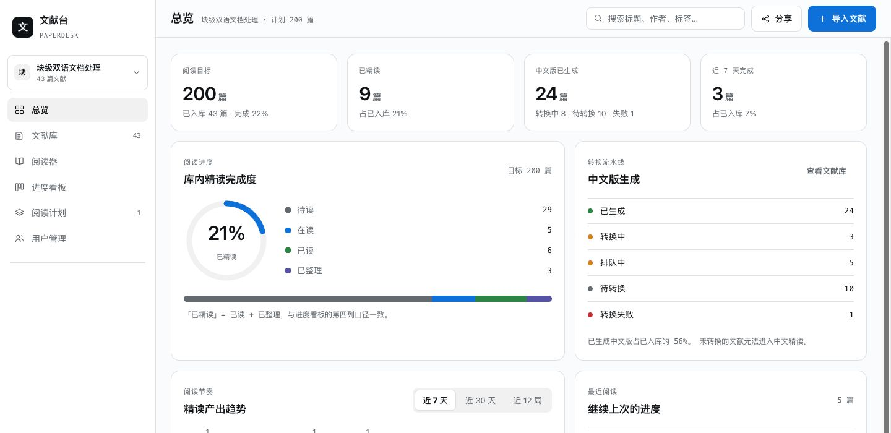
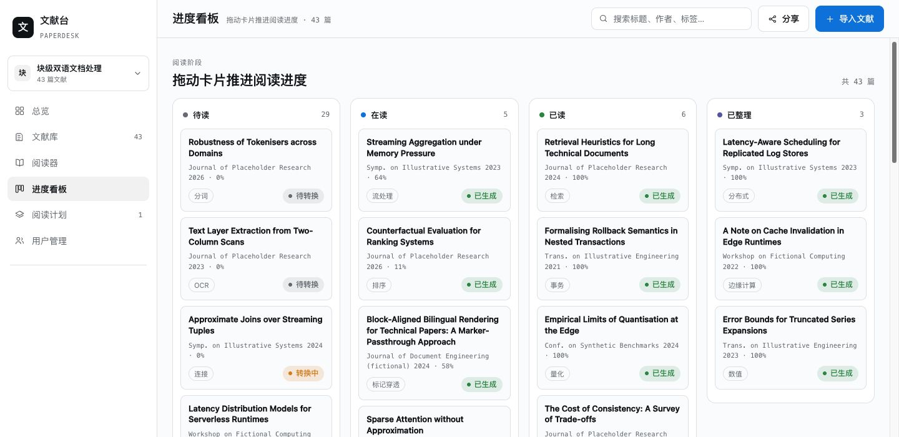
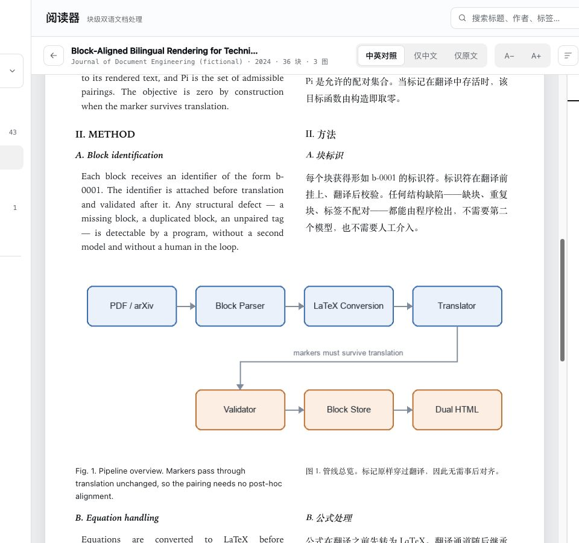

# papershelf

**自托管的文献精读工作台：把论文 PDF 变成左右并排的中英对照精读页。**

丢进一篇 PDF（或一个 arXiv 链接），它自动帮你完成：解析版式 → 分块翻译 → 公式转 MathML →
生成带块 ID 的对照页面。然后你在这上面划进度、做笔记、改译文、分享给同学或导师。

不依赖任何 CDN，不需要科学上网，一个容器跑起来，数据全在你自己服务器上。



> 以上截图均为**演示数据**：论文标题、作者、正文、图表、参考文献全部为虚构，与任何真实论文无关。

---

## 核心能力：管理并跟踪一整个阅读计划

写一篇论文通常要读**约 200 篇**相关文献。真正难的不是把某一篇翻译出来，
而是**知道这 200 篇各自读到哪儿了**——哪些入库了、哪些有中文版、哪些精读过、
哪些读了半截停了三周。散落在文件夹里的 PDF 给不了这个答案。

papershelf 把它们组织成**阅读计划**：一个计划 = 一次调研（比如"块级双语文档处理"），
文献按 `待读 → 在读 → 已读 → 已整理` 四个阶段推进，进度自动累积。

### 总览：这个计划走到哪儿了

**这是 papershelf 的主界面，也是它和"翻译工具"最本质的差别。** 一屏回答：

- **离目标还差多少**：阅读目标 200 篇，已入库 43 篇 → 完成 22%，还差 157 篇
- **精读完成度**：四阶段分布（圆环 + 堆叠条），已精读 9 篇
- **中文版生成情况**：已生成 / 转换中 / 排队 / 待转换 / 失败，一眼看出管线卡在哪
- **阅读节奏**：近 7 天 / 30 天 / 12 周的完成曲线，含日环比
- **需要关注**：转换失败的文献、生成完中文版却 14 天没开始的、在读停摆 21 天以上的
- **最近阅读**：直接点回去继续读



进度有两种来源，语义是刻意设计的：**滚动阅读自动推进**（只增不减——回退对"读到过哪里"没有意义），
但**手动改状态永远优先**。标成"已读"锁定到 100%，标回"未读"则清零。

### 进度看板：拖动卡片推进阶段

四列对应四个阅读阶段，拖一下就从"待读"变"在读"。状态一改就盖时间戳，
总览的节奏曲线由此而来。



---

## 为什么不是「丢给翻译工具一篇篇翻」

普通翻译工具的问题不是翻得不好，而是**翻完就对不上了**：中文段落和英文段落没有对应关系，
公式被翻坏了，图注丢了，参考文献被强行翻译，读起来像两篇无关的文章。

papershelf 的核心是**翻译前先给每个块打上标记，翻译后校验标记是否原样保留**。
配对不是"事后对齐"出来的，而是**构造上保证**的：

```
PDF / arXiv
   │
   ├─① 解析 ────────▶ 英文 HTML（每块带 data-b="b-XXXX" 标记）
   │                     │
   │                     ├─② 公式 LaTeX 化（在翻译之前）
   │                     │
   │                     ├─③ 按标记边界分块翻译（注入术语表）
   │                     │
   │                     ├─④ 标记保真校验 ◀── 纯程序判定，不靠模型自觉
   │                     │
   │                     └─⑤ 块级 JSON 入库
   │                            │
   └────────────────────────────┴──▶ ⑥ 单文件双语 HTML（导出 / 分享）
```

中英两版**共用同一套块 ID**，所以：

- 阅读器里中英**行行对齐**，滚动联动，不用自己找位置
- 任意一块可以**单独重译**，不用重跑全文
- 译文可以**手工修改**，且重跑转换**不会覆盖**你的修改（`zh_source='human'`）
- 笔记锚定在块上，中英两边都能挂
- **拖选任意一段文字就能划重点**（中英两边都能划）—— 四支颜色笔，划多长就是多长，不必正好整句；
  选中任意一段也能写笔记，点笔记**自动滚回划住的那几个字**

校验器只认**结构性问题**（缺块、多块、标签不配对、该译未译）才拦截；
数字改写、日期中文化这类一律降级为警告——否则它会自己触发重译、陷入死循环
（这个坑不是猜的，是烧掉 19.6k tokens 之后才想明白的）。

## 几个不那么显然的设计取舍

- **公式不用 CDN、不用 KaTeX**：`latex2mathml` 纯 Python 在服务端把 LaTeX 转成 MathML，
  浏览器原生就能渲染。实测真实论文 366 个行内公式 + 57 个展示公式**全部成功**。
  代价是放弃 KaTeX 的排版精细度，换来的是**离线可用、零 JS 运行时**。
- **给模型的永远是 LaTeX 源码，不是 MathML**：编号写在 `\tag{}` 里，喂渲染结果等于让模型去猜对应关系——
  既贵又必错。渲染与校验**刻意分流**（`render_block(typeset=False)` 是默认值，漏传宁可显示源码）。
- **免中文的块必须显式豁免**：参考文献（约 26%）和公式块按规则本就保持英文，
  如果不标记，会被判成"漏译"→ 送去翻译 → 还是不译 → 再送，死循环。
- **标题识别不看字号**：IEEE 模板里标题和正文同为 10pt，只能靠字体特征 + 编号模式（`I.` + Helvetica = 二级标题）。

## 功能

| 视图 | 说明 |
|---|---|
| **总览** | 计划目标、精读完成度、转换流水线状态、近 7 天阅读节奏 |
| **文献库** | 全部文献 + 状态/进度/中文版状态，支持按状态筛选、搜索、排序 |
| **阅读器** | 中英对照 / 仅中文 / 仅原文三模式，字号调节、大纲跳转、PDF 分页、块级标记已读、**划痕**（拖选任意一段文字 → 四支颜色笔，不等同于整句）+ **区间笔记** + **点笔记跳回原句**（从文献库/看板的文献行进入） |
| **进度看板** | 拖卡片推进阅读阶段（待读 → 在读 → 已读 → 已整理） |
| **阅读计划** | 多计划管理、术语表、分享链接 |
| **分享管理** | 一张表管住所有分享链接：有效期倒计时、状态、复制/预览、重置有效期、随时取消 |
| **管理页** | 用户列表、开号、停用/启用、重置密码（配置走环境变量，页面只做这四件事） |

<p align="center">
  
</p>

**版式保真**是这个阅读器的重点：公式由服务端转成 MathML 由浏览器原生排版**原样保留**，
插图不重画、不替换，**图注同样被翻译**，正文对公式和图的编号引用不会错位。
图内文字保持原文（原论文插图本来就是英文），被翻译的是图注。

**翻译成本可见**：每篇的 `tokens_used` 都记着，方便估算一篇要烧多少钱。

## 分享：整站只读，不是另做一个页面

分享链接打开的是**和分享者看到的一模一样**的界面——侧栏、顶栏、各个视图全在，
只是所有写入口都消失了（`body.readonly` 隐藏 + 后端 403 硬拒）。

- **实时**：分享者改了什么，访客刷新就是最新，不是快照
- **匿名**：持有链接即可读，不用注册（导师不会为了看你进度去注册）
- **可控**：可以同时建**多个**分享链接（给导师一条、组会一条），随时**取消**或**重置有效期**，
  取消/续期**对访客立即生效**；有效期**最长 24 小时**，到期自动失效
- **看得见**：分享出去的只读页顶部带**有效期倒计时**；「分享管理」页一张表列出所有链接
  （有效/即将到期/已过期/已取消 + 各自剩余时间），带备注便于区分是发给谁的
- **范围**：一个链接对应一个阅读计划；越权访问其他文献由服务端 404

## 快速开始

镜像由 GitHub Actions 构建推送到 GHCR（amd64 / arm64 双架构），**部署机不需要 Node 或 Python 工具链**。

```bash
git clone https://github.com/argszero/papershelf.git && cd papershelf
cp .env.example .env        # 至少填 PAPERSHELF_SECRET / LLM Key / 管理员
docker compose up -d
open http://localhost:8000
```

形态就一句话：**一个容器 + 一个数据卷（`/data`）+ 一组环境变量**。
没有 Redis，没有 Celery，没有独立前端服务。

完整部署说明（反代 + HTTPS、邮件配置、备份恢复、排障、国内镜像源）见 **[docs/install.md](docs/install.md)**。

**最少需要配什么**：

| 变量 | 作用 |
|---|---|
| `PAPERSHELF_SECRET` | 会话签名密钥，必填 |
| `PAPERSHELF_LLM_BASE_URL` / `_API_KEY` / `_MODEL` | OpenAI 兼容接口，**服务端统一 Key**（用户不用各自配置） |
| `PAPERSHELF_ADMIN_EMAIL` / `_PASSWORD` | 首个管理员（**必须显式给密码**，不做静默默认密码） |
| `PAPERSHELF_SMTP_*` | 配全则开放自助注册（邮箱验证码）；**不配则自动关闭注册**，改由管理员开号 |

## 技术栈

**后端** Python 3.11+ · FastAPI · SQLite · uvicorn
**前端** React 19 · TypeScript · Vite（构建产物由服务端同源提供）
**解析** PyMuPDF · **公式** latex2mathml · **密码** argon2

```
src/papershelf/
├── pipeline/          # 转换管线（可脱离服务端单独用 CLI 跑）
│   ├── parse.py       # PDF → 块级 JSON（标题识别、图注配对、数学行合并）
│   ├── equations.py   # Unicode 数学 → LaTeX
│   ├── translator.py  # 分块翻译（术语表注入、断点续跑）
│   ├── validate.py    # 标记保真校验（纯程序）
│   ├── mathml.py      # LaTeX → MathML（服务端）
│   └── synth.py       # 合成单文件双语 HTML
├── server/            # FastAPI 单体：认证 / 计划 / 文献 / 分享 / 导出 / 管理
└── cli.py             # parse | latex | translate | check | export | serve
web/                   # React SPA
```

**管线可以单独跑**——不想用服务端，只想要转换质量，直接：

```bash
papershelf parse paper.pdf -o out/          # 解析 → doc.json + en.html
papershelf latex out/doc.json -o out/       # 公式 LaTeX 化（必须在 translate 之前）
papershelf translate out/doc.json -o out/   # 分块翻译（--resume 续跑）
papershelf check out/doc.json               # 标记保真校验
papershelf export out/doc.json -o full.html --mode dual
```

> ⚠️ `latex` 必须在 `translate` **之前**：LaTeX 化会清空受影响块的译文，译文由构造继承同一份 LaTeX。
> `--resume` 会精确补翻这些块（人工修订始终保留）。**命令顺序即依赖，不能换位。**

## 开发

```bash
# 跑测试：92 项离线回归，不调 LLM、不联网
PYTHONPATH=src python -m pytest tests -q

# 前端（只需构建一次，产物写入 src/papershelf/static/）
cd web && npm install && npm run build

# 本地起服务
export PAPERSHELF_SECRET=$(python -c 'import secrets;print(secrets.token_urlsafe(32))')
export PAPERSHELF_LLM_BASE_URL=https://api.siliconflow.cn/v1
export PAPERSHELF_LLM_API_KEY=sk-...
export PAPERSHELF_LLM_MODEL=deepseek-ai/DeepSeek-V3
PYTHONPATH=src python -m papershelf serve --host 0.0.0.0 --port 8000
```

测试套件里有一些**不常见但值得保留**的护栏：

- `test_style_guard.py`——防止页面里手写分享路径、防止分享页退化成独立精简页、图片必须有宽高占位
  （懒加载图片没有宽高会让整篇高度事后上浮 7.3k px，大纲跳转直接偏位）
- `test_workflow_guard.py`——5 条发布流水线护栏。起因是一次**CI 全绿却把刚发布的镜像删光**的事故：
  清理步骤的版本保护名单没覆盖 `latest` 和 `sha-<commit>`，于是"验证成功"的下一步就是删掉交付物。

## 状态

- **M1 ✅** 转换管线闭环——真实论文跑通：545 块 / 184 块 LaTeX 化 / display 57 + inline 366 / 校验一次通过
- **M2 ✅** 后端：认证（邮箱验证码）· 计划 · 导入（PDF + arXiv）· 块级修订 · 笔记 · 分享 · 导出 · 管理页
- **M3 ✅** 前端 SPA：五个视图 + 阅读器三模式 + 只读分享
- **M4 ✅** Docker 化：多阶段镜像（非 root）、启动前显式校验配置、CI 双架构构建 + 真起容器冒烟
- **M5 ✅** 复刻验证：真浏览器逐页对照原型截图 + 逐交互实测
- **M6 ✅** 精读交互补齐：侧栏去掉独立「阅读器」入口（阅读器回归为文献库的下级页）、**划痕**（任意字符区间 + 四支不带含义的颜色笔）、区间笔记、点笔记跳回原句
- **下一步**：图表 VLM 说明 · 用量面板 · 跨计划检索

## 文档

- **[docs/design.md](docs/design.md)** —— 技术设计：数据模型、API 契约、管线细节、每个决策的理由
- **[docs/install.md](docs/install.md)** —— 部署运维：反代、邮件、备份、排障

## 许可

`LICENSE` 文件尚未添加——在那之前，默认保留所有权利，欢迎先提 issue 讨论。
